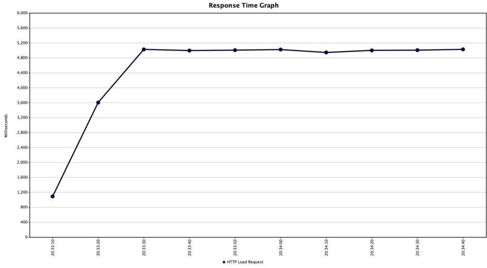
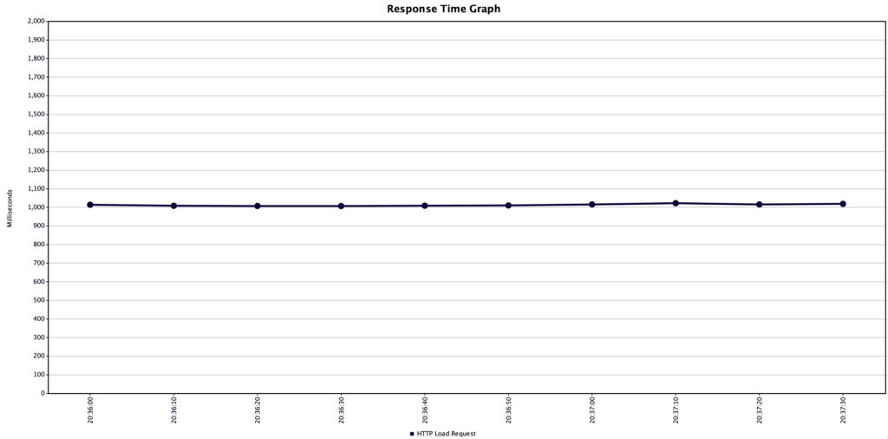
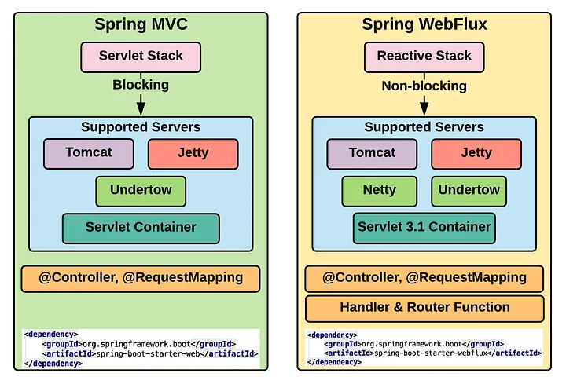
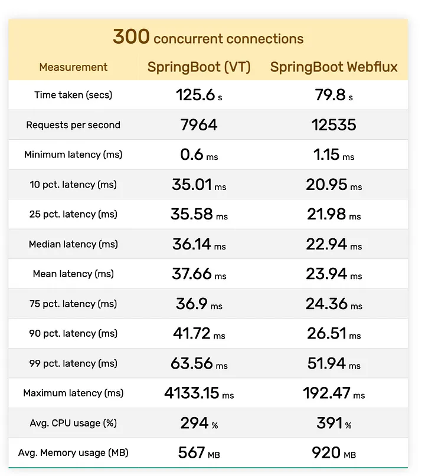
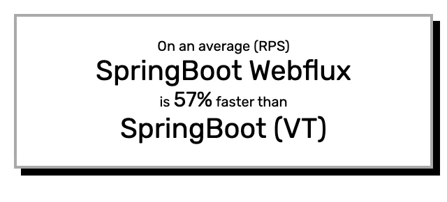

# Welcome Java 21!

## The most important feature ...

Just remember about following flags
```
--release 21 --enable-preview
```

## String concatenation suck

Other languages:
```
C#             $"{x} plus {y} equals {x + y}"
Visual Basic   $"{x} plus {y} equals {x + y}"
Python         f"{x} plus {y} equals {x + y}"
Scala          s"$x plus $y equals ${x + y}"
Groovy         "$x plus $y equals ${x + y}"
Kotlin         "$x plus $y equals ${x + y}"
JavaScript     `${x} plus ${y} equals ${x + y}`
Ruby           "#{x} plus #{y} equals #{x + y}"
Swift          "\(x) plus \(y) equals \(x + y)"
```

Java way ...

### String concatenation
```java
"Today's weather is " + feelsLike + 
      ", with a temperature of " + temperature + " degrees " + unit;
```

### String buider
```java
new StringBuilder()
      .append("Today's weather is ")
      .append(feelsLike)
      .append(", with a temperature of ")
      .append(temperature)
      .append(" degrees ")
      .append(unit)
      .toString();
```
### String formatter
```java
String.format("Today's weather is %s, with a temperature of %s degrees %s", 
      feelsLike, temperature, unit);
```

### Message format
```java
MessageFormat.format("Today''s weather is {0}, with a temperature of {1} degrees {2}",
      feelsLike, temperature, unit);
```

And we still do have several ways in Java 21:
- STR
- FMT (import static java.util.FormatProcessor.FMT)
- RAW (import static java.lang.StringTemplate.RAW)

## Virtual Threads

Definition:
- A virtual thread is an instance of java.lang.Thread that is not tied to a particular OS thread. A platform thread, by contrast, is an instance of java.lang.Thread implemented in the traditional way, as a thin wrapper around an OS thread.

Goals:
- Enable server applications written in the simple thread-per-request style to scale with near-optimal hardware utilization.
- Enable existing code that uses the java.lang.Thread API to adopt virtual threads with minimal change.
- Enable easy troubleshooting, debugging, and profiling of virtual threads with existing JDK tools.

### Virtual Threads vs Platform Threads

**Virtual threads** are cheap and plentiful, and thus should never be pooled: A new virtual thread should be created for every application task. Most virtual threads will thus be short-lived and have shallow call stacks, performing as little as a single HTTP client call or a single JDBC query.
**Platform threads**, by contrast, are heavyweight and expensive, and thus often must be pooled. They tend to be long-lived, have deep call stacks, and be shared among many tasks.

Spring with Platform Threads:



Spring with Virtual Threads:



### Running Spring Applications on Virtual Threads
```java
@Bean(TaskExecutionAutoConfiguration.APPLICATION_TASK_EXECUTOR_BEAN_NAME)
public AsyncTaskExecutor asyncTaskExecutor() {
  return new TaskExecutorAdapter(Executors.newVirtualThreadPerTaskExecutor());
}

@Bean
public TomcatProtocolHandlerCustomizer<?> protocolHandlerVirtualThreadExecutorCustomizer() {
  return protocolHandler -> {
    protocolHandler.setExecutor(Executors.newVirtualThreadPerTaskExecutor());
  };

```

... and configuration:
```yaml
spring:
    thread-executor: virtual
    //...
```

### Reactive programing
Webflux example:
```java
	this.posts
		.deleteAll()
		.thenMany(
			Flux
				.just("Post one", "Post two")
				.flatMap(
					title -> this.posts.save(Post.builder().title(title).content("content of " + title).build())
				)
		)
		.log()
		.subscribe(
			null,
			null,
			() -> log.info("done initialization...")
		);
```

### Webflux vs Spring Boot with VT



Performance: 



... so ...



### When to use?
- Available connections in a connection pool
- Sufficient memory to serve the increased load
- Unused CPU time

## Record matching
- Switch class type matching
- Switch record matching
- If record Matching

# Resources
- [Working with **Virtual Threads** in Spring 6](https://www.baeldung.com/spring-6-virtual-threads)
- [Spring MVC Async vs Spring **WebFlux**](https://www.baeldung.com/spring-mvc-async-vs-webflux)
- [Spring Boot vs Spring Webflux: Performance comparison for hello world case](https://medium.com/deno-the-complete-reference/spring-boot-vs-spring-webflux-performance-comparison-for-hello-world-case-386da4e9c418)
- [Spring: Embracing Virtual Threads](https://spring.io/blog/2022/10/11/embracing-virtual-threads/)
- [JEP 425: **Virtual Threads** (Preview)](https://openjdk.org/jeps/425)
- [Java - **String Template** Processors (STR, FMT, RAW) Examples](https://www.woolha.com/tutorials/java-string-template-processors-str-fmt-raw-examples)
- [Java 21 Scoped Values: A Deep Dive with Examples](https://howtodoinjava.com/java/multi-threading/java-scoped-values/)
- [Java 21 String Templates](https://howtodoinjava.com/java/java-string-templates/)
- [Java Record Patterns and Pattern Matching](https://howtodoinjava.com/java/record-patterns-and-pattern-matching/)
- [JEP 439: Generational ZGC](https://openjdk.org/jeps/439)
- [Java 21 Features (LTS): Practical Examples and Insights](https://howtodoinjava.com/java/java-21-new-features/)